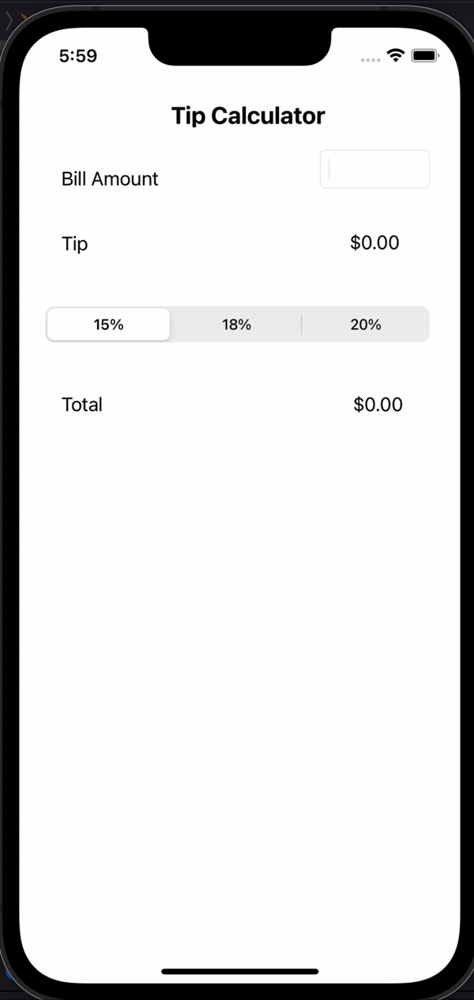

# Tip Calculator
Best calculator on the market
Author: Jun
Time spent: two hours 

## Features
* [X] user enters bill amount, chooses a tip percentage, and sees total cost
* [X] user can select between tip percentages by tapping different values on the segmented control and the tip value is updated thoroughly.

Optional features 
*[] Making sure the keyboard is always visible and the bill amount is always the first responder

## video walkthrough

## notes 

## license

Copyright 2022 Jun Pyo

Licensed under tge Apach License, version 2.0 (the "License"); you may not use this file except in compliance with the License. You may obtain a copy of the license at http://www.apache.org/licenses/LICENSE-2.0\

Unless required by applicable law or agreed to in writing, software distributed under the License is distrubed on an "AS IS" BASIS without warranties or conditions of any kind, either express or implied. See the License for the specific language governing permissions and limitations under the license
